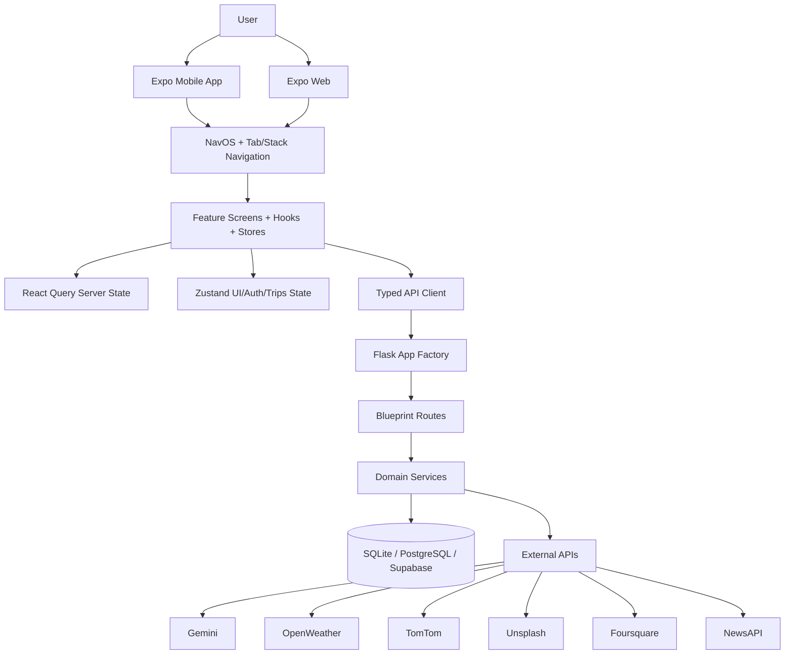
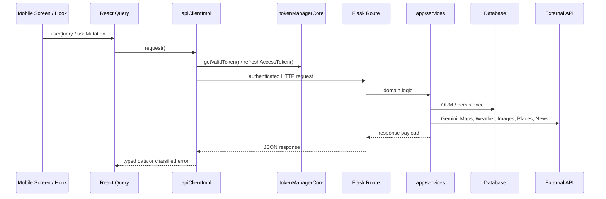

# Time To Travel

> A family-first, AI-assisted travel operating system for planning Indian trips end to end.

[](https://expo.dev/)
[](https://reactnative.dev/)
[](https://flask.palletsprojects.com/)
[](https://www.typescriptlang.org/)
[](https://www.python.org/)
[](https://tanstack.com/query/latest)
[](https://zustand.docs.pmnd.rs/)
[](https://www.docker.com/)
[](https://github.com/features/actions)

## At a Glance

| Dimension    | What ships today                                                                                                      |
| ------------ | --------------------------------------------------------------------------------------------------------------------- |
| Product      | Travel planning, discovery, budgeting, itinerary, reservations, sharing, and stats for Indian domestic travel.        |
| Client       | Expo mobile app with Android, iOS, and web targets.                                                                   |
| Server       | Flask API with blueprints, ORM models, auth, rate limiting, CSRF, and CORS.                                           |
| Data         | Curated destination data, safety scores, budget baselines, and persistent trip data.                                  |
| AI           | Gemini chat with a deterministic classic ML fallback, plus explainable recommendation engines.                        |
| Delivery     | Docker, Docker Compose, gunicorn, and GitHub Actions CI/CD workflows.                                                 |
| Architecture | Auth-gated mobile navigation, lazy-loaded tab stacks, query caching, secure token refresh, and feature-first modules. |

## Overview

Time To Travel is a full-stack travel planning platform built around a very specific product thesis: domestic travel becomes much easier when budgeting, safety, weather, maps, itinerary planning, and sharing live in one place. The codebase is tuned for Indian travelers, especially families who need practical trip planning instead of generic inspiration.

The backend centralizes travel intelligence in a Flask application factory. The mobile client is an Expo app that mounts an auth-gated navigation shell, keeps server state in React Query, persists local state with Zustand and AsyncStorage, and stores credentials in secure device storage. AI is not bolted on as a novelty: the chatbot and recommendation layers include a Gemini-powered path and a deterministic fallback path so the app can keep working when the external model is unavailable.

The architecture matters because the product spans many travel surfaces at once. A budget estimate should feed itinerary decisions. A share link should resolve into a public trip view. A profile update should invalidate cached state. A trip should be usable on a physical device, in a browser, and in production behind a backend that enforces rate limits and secure cookies. This repository is built around those real-world constraints rather than a single-demo screen.

## Screenshots / Preview

> Replace the placeholders below with real captures from Expo web, an Android device, or an iOS simulator.

| Area            | Placeholder                            | What to capture                                                                |
| --------------- | -------------------------------------- | ------------------------------------------------------------------------------ |
| Home            | `docs/screenshots/home.png`            | Hero section, recommended destinations, and quick actions.                     |
| Explore         | `docs/screenshots/explore.png`         | Search, filters, destination cards, and list virtualization.                   |
| AI Assistant    | `docs/screenshots/chat.png`            | Gemini/classic assistant handoff and contextual prompts.                       |
| Maps / Routes   | `docs/screenshots/maps.png`            | Route planner, itinerary map, and map interactions.                            |
| Personalization | `docs/screenshots/personalization.png` | Trips hub, behavior-driven recommendations, and saved preferences.             |
| Bookings        | `docs/screenshots/bookings.png`        | Reservations, sharing, expenses, and trip workspace flows.                     |
| Profile         | `docs/screenshots/profile.png`         | Account summary, XP or progress surfaces, and user settings.                   |
| Analytics       | `docs/screenshots/analytics.png`       | Travel stats, journey summaries, and event-driven insights.                    |
| Admin / Ops     | `docs/screenshots/admin.png`           | No dedicated admin screen ships yet. Reserve this slot for future ops tooling. |

<details>
<summary>Capture guide</summary>

Use the app entry at [TimeTravelMobile/App.tsx](TimeTravelMobile/App.tsx), the auth gate in [TimeTravelMobile/src/navigation/NavOS/index.tsx](TimeTravelMobile/src/navigation/NavOS/index.tsx), and the feature screens under [TimeTravelMobile/src/screens](TimeTravelMobile/src/screens) to capture representative UI states. Prefer real data, loading states, and one error state per major surface.

</details>

## Key Features

### Core Features

- Trip planning is centered around Indian destinations, with the backend serving route-specific data for budgets, weather, safety, maps, places, images, reservations, notes, packing, and travel stats.
- The app covers the full trip lifecycle: discover a destination, estimate the budget, build an itinerary, save favorites, plan routes, store reservations, track expenses, and share the trip.
- Public sharing is supported through share tokens and web-safe share URLs that resolve to the web app base instead of the API root.
- The client uses a clear split between auth flows and authenticated app flows, so users do not land in an unstable mixed state.

### AI Features

- The chatbot prefers Gemini when configured and falls back to a deterministic local classifier engine when the AI service is unavailable.
- Gemini sessions are bounded with a TTL, a hard session cap, and capped history depth so conversations stay finite and operationally safe.
- Recommendation services are explainable rather than opaque: destination scoring is driven by user preferences, popularity, context, seasonality, social proof, and budget fit.
- Travel prompts are tailored for family-focused, budget-aware planning and consistently return INR-centric guidance.

### Performance Features

- React Query is configured with a 5 minute stale window, 30 minute cache retention, reconnect refetching, and retry logic that avoids retrying client errors.
- The API client deduplicates pending requests, refreshes expired tokens automatically, and retries transient failures with exponential backoff and jitter.
- Heavy list screens use FlashList where it matters, instead of forcing every collection through a generic FlatList path.
- Navigation, tab icons, and many screen surfaces use lazy loading, Suspense fallbacks, memoized wrappers, and skeleton loaders to reduce perceived latency.
- Animated and platform-specific UI branches are kept local, so web builds avoid unnecessary native-only work and native builds get hardware-backed animation paths.

### UX Features

- The mobile shell is auth-gated, deep-link aware, and resilient to failed tab renders through local error boundaries.
- The navigation layer exposes role-aware tabs, badge counts, and centralized deep-link paths so routes behave consistently across app launches and share links.
- The design uses gradient surfaces, glass-like cards, press-scale interactions, animated tab icons, and screen skeletons to keep the experience polished without becoming noisy.
- Safe area handling, keyboard avoidance, and platform-specific shadow behavior are implemented where the UI needs them.

### Offline Features

- Auth tokens are persisted securely, and app state can restore itself on cold start without asking the user to sign in again every time.
- The client includes offline queueing and sync primitives for queued mutations, along with cache managers that support TTL, tags, and LRU eviction.
- React Query is configured to refetch on reconnect, which makes the app recover gracefully after temporary network loss.
- Several screens and services intentionally guard against undefined or empty local state so web and device flows fail soft instead of crashing.

### Security Features

- Passwords are handled on the backend with bcrypt, while mobile credentials are stored in SecureStore on native platforms and a best-effort web fallback.
- Flask-Limiter, CSRF protection, CORS allowlists, and security headers are configured centrally in the Flask app factory.
- The mobile API client uses bearer tokens, automatic refresh, request metadata, and explicit error classification to keep auth behavior predictable.
- Production settings require a stable secret key and enable secure cookie behavior.

### Engineering Features

- The backend uses an application factory and blueprint-based domain routing, which keeps endpoints grouped by responsibility rather than by transport detail.
- The mobile app is organized around feature modules such as auth, compare, phrasebook, profile, travel-intelligence, and trip-sharing.
- TypeScript path aliases are centralized in both Babel and tsconfig, so imports stay stable as the repository evolves.
- The repo includes GitHub Actions workflows for linting, tests, coverage, and Docker smoke checks.

### Scalability Features

- The backend supports SQLite for local development and PostgreSQL or Supabase through `DATABASE_URL` for production.
- Trip data, user profile data, sharing, and stats are split across dedicated service layers instead of a single monolith route file.
- Cache, offline, telemetry, and navigation concerns are implemented as their own runtime layers in the mobile app.
- The architecture is ready for growth, but it still keeps transitional compatibility layers where refactors are incomplete, which is a healthy sign of real-world evolution rather than greenfield idealism.

### Developer Experience Features

- Strict TypeScript, path aliases, reusable hooks, and feature-local components reduce the cost of adding new screens.
- The backend ships with pytest fixtures, integration tests, and coverage-friendly CI rules.
- The mobile launcher script can bring up the backend and Expo together so developers do not need to wire two processes by hand every time.
- The repo preserves documentation and migration notes, which makes it easier to understand why certain compatibility shims still exist.

## Technical Architecture

Time To Travel uses a layered monorepo shape: a Flask backend handles persistent domain logic and third-party integrations, while an Expo client consumes that API through a typed networking layer and feature-first navigation shell.

The backend follows an application factory pattern in [app/main.py](app/main.py), with configuration in [app/config.py](app/config.py), route blueprints under [app/api/routes](app/api/routes), and domain services under [app/services](app/services). The mobile client starts in [TimeTravelMobile/App.tsx](TimeTravelMobile/App.tsx), mounts `NavOS`, and composes the UI from feature modules, shared UI primitives, and store-backed state.



A few architectural choices are worth calling out explicitly:

- Navigation is centralized. [TimeTravelMobile/src/navigation/config/tabConfig.ts](TimeTravelMobile/src/navigation/config/tabConfig.ts) defines the route taxonomy, permissions, badges, analytics metadata, and deep-link paths.
- Server state is centralized. [TimeTravelMobile/src/api/queryClient.ts](TimeTravelMobile/src/api/queryClient.ts) owns cache behavior, retries, and key conventions.
- Auth is split on purpose. `tokenManagerCore` owns token storage and refresh, while the stores and screens consume the result.
- Performance primitives are reusable. Skeleton loaders, press-scale wrappers, animated tab icons, and glass cards are shared instead of being reimplemented per screen.
- The repo keeps compatibility wrappers where needed so a refactor can land without breaking the existing runtime surface.

## Project Structure

Representative tree of the active codebase:

```text
.
├── app/
│   ├── api/
│   │   └── routes/
│   ├── models/
│   ├── services/
│   ├── static/
│   ├── templates/
│   ├── utils/
│   └── main.py
├── data/
│   ├── india_destinations.json
│   ├── budget_baselines.json
│   └── safety_scores.json
├── deploy/
│   └── kubernetes/
├── scripts/
│   ├── start_mobile_dev.sh
│   ├── migrate_to_supabase.py
│   ├── test_connection.py
│   └── validate_destinations.py
├── supabase/
│   └── schema.sql
├── tests/
│   ├── test_auth.py
│   ├── test_chatbot.py
│   ├── test_budget.py
│   ├── test_integration.py
│   └── ...
├── TimeTravelMobile/
│   ├── App.tsx
│   ├── app.json
│   ├── index.ts
│   ├── babel.config.js
│   ├── package.json
│   └── src/
│       ├── api/
│       ├── components/
│       ├── constants/
│       ├── core/
│       ├── domain/
│       ├── features/
│       ├── hooks/
│       ├── infrastructure/
│       ├── navigation/
│       ├── screens/
│       ├── services/
│       ├── shared/
│       ├── stores/
│       ├── theme/
│       ├── types/
│       └── utils/
├── Dockerfile
├── docker-compose.yml
├── docker-compose.prod.yml
├── requirements.txt
├── run.py
├── README.md
└── .github/
    └── workflows/
```

<details>
<summary>Repository notes</summary>

The root also contains a number of audit, phase, and starter migration artifacts. They are preserved for traceability and documentation context. The active runtime path is the Flask app under [app/](app/) and the Expo app under [TimeTravelMobile/](TimeTravelMobile/).

</details>

## Tech Stack

| Layer             | Stack                                                                                                                                | What it does                                                                   |
| ----------------- | ------------------------------------------------------------------------------------------------------------------------------------ | ------------------------------------------------------------------------------ |
| Frontend / Mobile | Expo 54, React Native 0.81.5, React 19.1.0, React Navigation 7, react-native-paper 5, FlashList 2, Reanimated 4, safe-area-context 5 | Mobile UI shell, navigation, animation, and list rendering.                    |
| Backend           | Flask 3.x, Flask-SQLAlchemy, Flask-Login, Flask-WTF, Flask-Limiter, Flask-CORS, bcrypt                                               | API factory, persistence, auth, CSRF, rate limiting, and cross-origin support. |
| State Management  | Zustand 5, React Query 5, AsyncStorage, SecureStore                                                                                  | Auth state, UI state, trips state, and server-state caching.                   |
| AI / ML           | Google Gemini, scikit-learn, TF-IDF, logistic regression                                                                             | Travel chatbot, fallback assistant, and recommendation scoring.                |
| APIs              | Axios, OpenWeatherMap, TomTom, Unsplash, Foursquare, NewsAPI                                                                         | Transport, weather, places, images, and news integrations.                     |
| Storage           | SQLite, PostgreSQL, Supabase, AsyncStorage, Expo SecureStore                                                                         | Local dev persistence, production DB, and on-device storage.                   |
| DevOps            | Docker, Docker Compose, gunicorn, GitHub Actions                                                                                     | Container builds, runtime hardening, and CI/CD.                                |
| Tooling           | TypeScript, Python 3.11+, Babel module-resolver, Pytest, Black, Flake8                                                               | Type safety, code style, and test automation.                                  |
| Performance       | Query caching, request deduplication, exponential backoff, lazy loading, LRU cache, offline queues                                   | Lower latency, better recovery, and less wasted work.                          |
| Testing           | Pytest, pytest-flask, integration tests, Docker smoke checks                                                                         | Backend and deployment validation.                                             |

## Performance Engineering

The project uses practical performance controls instead of generic “optimize later” promises.

- React Query defaults keep data fresh for 5 minutes, retain cache for 30 minutes, refetch on reconnect, and retry only when a request is still retryable.
- The main API client deduplicates identical pending requests, refreshes expired tokens, and backs off exponentially on transient failures.
- `NavOS` and the tab navigator lazy-load feature stacks with `React.lazy` and `Suspense`, which reduces the cost of opening the app and keeps heavy screens out of the initial bundle path.
- FlashList is used in high-volume views such as Explore and Phrasebook so large collections stay smooth.
- Skeleton loaders and animated placeholders keep loading states intentional instead of blank.
- Cache managers in `src/core/cache` support TTL, tags, and LRU eviction, which makes client-side invalidation predictable.
- Platform-aware rendering branches avoid evaluating native-only behavior on web, which keeps the Expo web build stable.

## AI Capabilities

Time To Travel does not use AI as a decoration layer. It uses it as a travel-specific decision engine.

| Capability                      | Implementation                                                                                                                              |
| ------------------------------- | ------------------------------------------------------------------------------------------------------------------------------------------- |
| Conversational travel assistant | [app/api/routes/chatbot.py](app/api/routes/chatbot.py) selects Gemini when available and falls back to a classic local classifier when not. |
| Context-aware session memory    | [app/services/gemini_service.py](app/services/gemini_service.py) keeps bounded sessions with TTL and history limits.                        |
| India-specific persona          | The system prompt is tuned for budget-conscious, family-oriented travel planning in INR.                                                    |
| Explainable recommendations     | [app/services/recommendation_engine.py](app/services/recommendation_engine.py) returns score breakdowns and deterministic reasons.          |
| Preference-aware ranking        | [app/services/ai_recommendations.py](app/services/ai_recommendations.py) incorporates budget, seasonality, popularity, and user affinity.   |
| Graceful degradation            | The chatbot and recommendation paths fall back instead of hard failing when external AI services are missing or rate limited.               |

A useful way to think about the AI stack is that it has two layers: a generative layer for open-ended help and a deterministic scoring layer for ranking destinations and explaining why a result was surfaced.

## Scalability & Architecture Decisions

The repository scales because responsibilities are separated at the right boundaries.

- The backend is split into blueprints and services, so a budget change does not require touching auth or maps logic.
- The mobile app is split by feature, not by file type, which keeps auth, compare, phrasebook, profile, travel-intelligence, and trip-sharing easy to evolve independently.
- Shared config surfaces such as `config.ts`, `tabConfig.ts`, and `queryClient.ts` reduce drift and make cross-cutting behavior explicit.
- Compatibility wrappers are used where a refactor has not fully converged yet, so the active app can remain stable while the codebase is normalized.
- The backend can run locally on SQLite and move to PostgreSQL or Supabase without changing the core API contract.
- The mobile client persists the right things in the right places: server state in React Query, UI/auth state in Zustand, credentials in SecureStore, and navigation state in AsyncStorage.

## Developer Experience

The project is set up to be productive for contributors who work across both the Python backend and the TypeScript mobile app.

- TypeScript path aliases are configured in both `tsconfig.json` and Babel, so imports stay readable without relative-path sprawl.
- Feature modules keep related hooks, services, components, and types together, which makes the app easier to reason about than a screen-only layout.
- The backend has a conventional Flask app factory and explicit config classes, which makes environment switching clear.
- `scripts/start_mobile_dev.sh` collapses the common local workflow into one command and reuses a healthy backend when possible.
- The repo uses CI workflows for formatting, tests, and Docker smoke validation, which helps catch regressions before merge.
- There are enough compatibility shims and migration artifacts to show the codebase has been iterated in the real world, not just scaffolded once and left untouched.

## Security & Reliability

| Control            | Implementation                                                                                                   |
| ------------------ | ---------------------------------------------------------------------------------------------------------------- |
| Token storage      | SecureStore on native platforms, with local fallback handling on web.                                            |
| Token refresh      | The client refreshes bearer tokens automatically and clears them on unrecoverable auth failure.                  |
| Rate limiting      | Flask-Limiter is configured at the app level, with endpoint-specific limits in sensitive routes.                 |
| CSRF               | API blueprints are exempted intentionally because mobile clients use API tokens rather than browser form posts.  |
| CORS               | The backend uses explicit origin allowlists, including localhost and LAN test origins.                           |
| Error handling     | API errors are classified into network, timeout, auth, validation, forbidden, rate-limit, and server categories. |
| Resilience         | Navigation and tab shells use error boundaries so one failed screen does not collapse the entire app.            |
| Production hygiene | Docker runs as a non-root user and exposes a health check on `/api/health`.                                      |

## Accessibility & UX

- Safe area insets are respected in the app shell and in key screens.
- KeyboardAvoidingView is used where forms need to stay usable on smaller devices.
- Tabs and important actions include haptic feedback where native devices support it.
- The auth screen uses deliberate motion and layered gradients rather than a flat form on a white surface.
- Platform-specific shadow and blur behavior keeps the UI feeling native on iOS, Android, and web.
- Loading, success, and error states are designed as first-class UX states rather than as afterthoughts.

## Installation

### Prerequisites

- Python 3.11 or newer.
- Node.js 18 or newer.
- npm.
- Git.
- Optional for device testing: Expo Go, Android emulator, iOS simulator, or a physical device.

### 1. Clone the repository

```bash
git clone <repo-url>
cd "TIMETRAVEL copy"
```

### 2. Backend setup

```bash
python3 -m venv .venv
source .venv/bin/activate
pip install -r requirements.txt
cp .env.example .env
python run.py
```

The backend listens on `http://localhost:5001` by default.

### 3. Mobile setup

```bash
cd TimeTravelMobile
npm install
npm run start
```

Useful Expo commands:

```bash
npm run web
npm run android
npm run ios
```

### 4. Start backend and mobile together

```bash
./scripts/start_mobile_dev.sh
```

Or from inside the mobile folder:

```bash
cd TimeTravelMobile
npm run dev:full
```

### 5. Production-style container run

```bash
docker compose up --build
```

## Environment Variables

The backend template lives in [./.env.example](.env.example). The mobile app also reads Expo public environment variables at runtime.

### Backend variables

| Variable                     | Purpose                                                   |
| ---------------------------- | --------------------------------------------------------- |
| `FLASK_ENV`                  | Selects development, testing, or production config.       |
| `SECRET_KEY`                 | Flask secret key; required for production.                |
| `DATABASE_URL`               | SQLite fallback or PostgreSQL/Supabase connection string. |
| `SUPABASE_URL`               | Supabase project URL.                                     |
| `SUPABASE_KEY`               | Supabase anon key.                                        |
| `SUPABASE_SERVICE_KEY`       | Supabase service role key.                                |
| `OPENWEATHER_API_KEY`        | Weather integration.                                      |
| `TOMTOM_API_KEY`             | Maps and routing integration.                             |
| `GOOGLE_API_KEY`             | Gemini AI integration.                                    |
| `UNSPLASH_ACCESS_KEY`        | Destination image search.                                 |
| `UNSPLASH_SECRET_KEY`        | Unsplash account credentials.                             |
| `FOURSQUARE_API_KEY`         | Places integration.                                       |
| `FOURSQUARE_CLIENT_ID`       | Places integration fallback.                              |
| `FOURSQUARE_CLIENT_SECRET`   | Places integration fallback.                              |
| `NEWSAPI_KEY`                | Travel news integration.                                  |
| `GLOBAL_RATE_LIMIT_PER_DAY`  | Global Flask-Limiter daily cap.                           |
| `GLOBAL_RATE_LIMIT_PER_HOUR` | Global Flask-Limiter hourly cap.                          |
| `AUTH_REGISTER_RATE_LIMIT`   | Registration limit.                                       |
| `AUTH_LOGIN_RATE_LIMIT`      | Login limit.                                              |

### Mobile variables

| Variable                               | Purpose                                                                    |
| -------------------------------------- | -------------------------------------------------------------------------- |
| `EXPO_PUBLIC_API_URL`                  | Backend API root. Include the `/api` suffix.                               |
| `EXPO_PUBLIC_WEB_URL`                  | Public web base used by share links. Defaults to `https://timetravel.app`. |
| `LAN_IP`                               | Local LAN fallback for physical devices.                                   |
| `EXPO_PUBLIC_TOMTOM_API_KEY`           | Client-side TomTom access.                                                 |
| `EXPO_PUBLIC_GOOGLE_WEB_CLIENT_ID`     | Google sign-in on web.                                                     |
| `EXPO_PUBLIC_GOOGLE_IOS_CLIENT_ID`     | Google sign-in on iOS.                                                     |
| `EXPO_PUBLIC_GOOGLE_ANDROID_CLIENT_ID` | Google sign-in on Android.                                                 |
| `EXPO_PUBLIC_GOOGLE_EXPO_CLIENT_ID`    | Google sign-in in Expo development.                                        |

Notes:

- `EXPO_PUBLIC_API_URL` should point to the deployed backend or your LAN machine during development.
- `10.0.2.2` is only appropriate for the Android emulator.
- The repository's `.env.example` currently documents backend settings; add the Expo variables to your local shell or Expo config as needed.

## Available Scripts

| Command                                   | Where      | Purpose                                                         |
| ----------------------------------------- | ---------- | --------------------------------------------------------------- |
| `python run.py`                           | Repo root  | Start the Flask backend in development mode.                    |
| `python run.py --prod`                    | Repo root  | Start the backend without the Flask reloader.                   |
| `./scripts/start_mobile_dev.sh`           | Repo root  | Start or reuse the backend, wait for health, then launch Expo.  |
| `cd TimeTravelMobile && npm run start`    | Mobile app | Start the Expo dev server.                                      |
| `cd TimeTravelMobile && npm run dev:full` | Mobile app | Run the full backend-plus-Expo launcher from the mobile folder. |
| `cd TimeTravelMobile && npm run web`      | Mobile app | Open the web target.                                            |
| `cd TimeTravelMobile && npm run android`  | Mobile app | Launch Android.                                                 |
| `cd TimeTravelMobile && npm run ios`      | Mobile app | Launch iOS.                                                     |
| `docker compose up --build`               | Repo root  | Build and run the containerized backend.                        |
| `pytest -v`                               | Repo root  | Run the backend test suite.                                     |

## API Architecture

The server exposes a broad travel domain under `/api/*`. Representative route groups include:

| Domain        | Example routes                                                                                                                 | Notes                                                       |
| ------------- | ------------------------------------------------------------------------------------------------------------------------------ | ----------------------------------------------------------- |
| Health        | `/api/health`                                                                                                                  | Used by the launcher and Docker health checks.              |
| Auth          | `/api/auth/*`, `/api/auth/v2/*`                                                                                                | Legacy session auth and the newer token-based flow coexist. |
| Chat          | `/api/chat`, `/api/chat/ai`, `/api/chat/classic`, `/api/chat/status`                                                           | Gemini path with classic ML fallback.                       |
| Planning      | `/api/budget/estimate`, `/api/itinerary/*`, `/api/trips/*`, `/api/trips/planner`                                               | Budgeting, trips, and itinerary flows.                      |
| Discovery     | `/api/destinations/*`, `/api/places/*`, `/api/maps/*`, `/api/weather/*`, `/api/safety/*`, `/api/images/*`, `/api/news/*`       | Content and travel intelligence services.                   |
| Ownership     | `/api/favorites/*`, `/api/reservations/*`, `/api/expenses/*`, `/api/packing/*`, `/api/share/*`, `/api/profile/*`, `/api/stats` | Saved data, sharing, analytics, and profile surfaces.       |
| Content tools | `/api/uploads/*`, `/api/notes/*`, `/api/language/*`, `/api/currency/*`, `/api/export/*`                                        | Supporting functionality around the trip workflow.          |



## State Management

| Layer                            | Responsibility                                                 | Notes                                                                      |
| -------------------------------- | -------------------------------------------------------------- | -------------------------------------------------------------------------- |
| `useAuthStore`                   | Auth state, user data, and login/logout lifecycle              | Persists user state and cooperates with the token manager for secure auth. |
| `tokenManagerCore`               | Access token, refresh token, expiry, and refresh deduplication | Stores tokens securely and refreshes them before they expire.              |
| `useTripsStore`                  | Trips feature state, favorites, recents, filters, and progress | Persists UI preferences and behavior-driven trip features.                 |
| `useUIStore`                     | Theme mode and UI preferences                                  | Used by the app shell to choose light or dark paper themes.                |
| `queryClient`                    | Server state cache and mutation retry policy                   | Centralized React Query client.                                            |
| `NavOS` persistence              | Navigation state across launches                               | Persisted in AsyncStorage for authenticated users.                         |
| `OfflineManager` / offline queue | Queued write actions and sync orchestration                    | Supports offline-capable mutation flows.                                   |
| `Analytics`                      | Session events and screen tracking                             | In-memory telemetry layer with listener support.                           |

## Design System

The visual system is intentionally consistent and easy to extend.

| Token / Primitive          | Purpose                                                                        |
| -------------------------- | ------------------------------------------------------------------------------ |
| `colors`                   | Primary blue, secondary pink, accent amber, and dark travel-night backgrounds. |
| `spacing`                  | Shared spacing scale for consistent rhythm.                                    |
| `typography`               | A Material-style type scale for titles and body text.                          |
| `lightTheme` / `darkTheme` | React Native Paper theme objects derived from the same palette.                |
| `GlassCard`                | Soft, blurred, premium surface treatment.                                      |
| `PressableScale`           | Tactile interaction primitive for buttons and cards.                           |
| `SkeletonLoader`           | Loading skeletons for itinerary, home, and destination surfaces.               |
| `AnimatedTabIcon`          | Animated navigation affordance with badge support.                             |
| `ScreenSkeletonLoader`     | Transitional loading state for navigation-level screen swaps.                  |

The auth screen is a good example of the system in practice: it combines gradient backgrounds, animated motion, safe-area aware spacing, and platform-aware interactions instead of relying on a flat default form layout.

## Future Roadmap

The codebase is already production-shaped, but there is still room to tighten and extend it.

- Remove the remaining legacy compatibility layers once all consumers have migrated to the canonical modules.
- Expand offline write paths so more trip actions can queue and reconcile cleanly.
- Add dedicated mobile test automation for the most important auth, planner, and share-link flows.
- Formalize route versioning across the backend so future API changes are even safer.
- Introduce richer observability or analytics export if product growth demands it.
- Add an admin or ops surface only if there is a real operational need; the current app does not ship one.

## Engineering Highlights

| Highlight                       | Why it matters                                                                                            |
| ------------------------------- | --------------------------------------------------------------------------------------------------------- |
| Full-stack monorepo             | One repository owns the mobile client, backend API, data sets, deployment, and tests.                     |
| Auth-gated navigation shell     | The app does not expose the main experience before auth state is known.                                   |
| AI with fallback                | Gemini is useful, but the app still works when Gemini is unavailable.                                     |
| Secure token lifecycle          | Tokens are separated from the HTTP client and stored with platform-appropriate security.                  |
| Offline-capable client          | React Query, AsyncStorage, secure storage, and queue managers work together instead of competing.         |
| Explainable travel intelligence | Recommendation engines return reasons and score breakdowns, which is useful for user trust and debugging. |
| CI and container delivery       | The repository can be linted, tested, built, and smoke-tested in automation.                              |
| India-specific data model       | The app is backed by curated destination, safety, and budget data rather than generic travel content.     |

## Lessons Learned

- Normalize backend/UI contract mismatches at the service boundary rather than inside every screen.
- Keep token refresh and transport concerns out of the auth store itself.
- Centralize navigation config so permissions, badges, analytics, and deep links stay aligned.
- Prefer lazy-loaded, feature-scoped navigation stacks over a single monolithic route tree.
- Treat loading and error states as part of the product, not as debug-only scaffolding.
- Keep config surfaces single-source. Duplicate `production` config files drift quickly.
- When a feature depends on external services, define a deterministic fallback path up front.

## Contributing

1. Fork or branch from the current repository state.
2. Set up the backend and mobile environments as described above.
3. Run the test and lint commands that apply to your changes.
4. Keep changes focused inside the relevant feature module or Flask blueprint.
5. Prefer adding tests for behavior changes, especially on the backend.
6. Avoid introducing new environment variables unless they are documented here.
7. Do not commit secrets, API keys, or generated build output.

Suggested pre-merge checks:

```bash
pytest -v
cd TimeTravelMobile && npm run web
```

## License

No license file is present in the repository at the moment. If you plan to publish this project publicly, add a license before accepting external contributions.

## Acknowledgements

Built with the help of the broader Expo, React Native, Flask, React Query, Zustand, gunicorn, Pytest, and Supabase ecosystems. External travel and enrichment services include Gemini, OpenWeather, TomTom, Unsplash, Foursquare, and NewsAPI.
